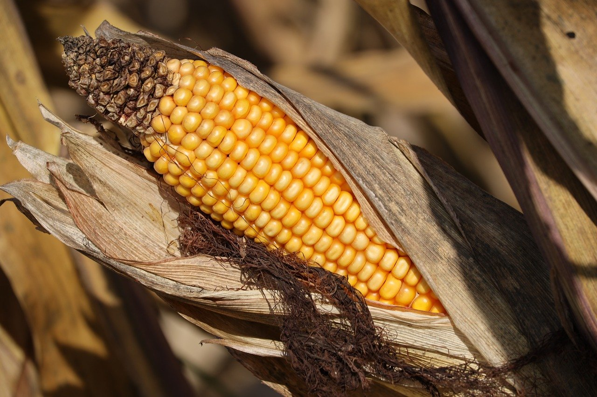

# CROP YIELD PREDICTION

<h4 align-left>Image by <a href="https://pixabay.com/users/goranh-3989449/?utm_source=link-attribution&utm_medium=referral&utm_campaign=image&utm_content=8299009">Goran Horvat</a> from <a href="https://pixabay.com//?utm_source=link-attribution&utm_medium=referral&utm_campaign=image&utm_content=8299009">Pixabay</a></a>

## INTRODUCTION

Farmers in mostly developing countries continue to face reduced crop yield due challenges of climate change and poor farming practices among several other factors. The ability to predict yield based on historical data, weather patterns, soil quality, and other relevant factors will help farmers optimize planting schedules, resource allocation, aand manage risk associated with climate variability. In this project, a model will be built to predict crop yield based of data obtained.

## ABOUT THE DATA

The data source is the Food and Agriculture Organization, and the World Bank. Details of the data can be obtained ([here](https://www.kaggle.com/datasets/patelris/crop-yield-prediction-dataset))

## PROBLEM STATEMENT

Crop yield in most farms in sub-saharan Africa continue to be poor due to climate variability. The ability to predict crop yield will ultimately help in risk management associated with climate change.

## DEPENDENCIES

The following libraries were imported and used for the analysis:

* Pandas
* Matplotlib
* Plotly express
* Sklearn

## DATA CLEANING

On inspecting the dataset, there is no missing values, and columns names were intuitive. Except that the columns like "unnamed: 0" and "Area" were droped prior to building the model.

## EDA

A hist plot was plotted to explore the distribution of the various features of the data. 

## CONCLUSION

Based on the evaluation metrics of the model, deploying it for use by farmers will help optimize farming practices, and minimize sik associated with climate variability.

## REFERENCE

1. Sklearn documentation
2. Kaggle website
3. Food and Agricultural Organization (FAO)
4. World Bank